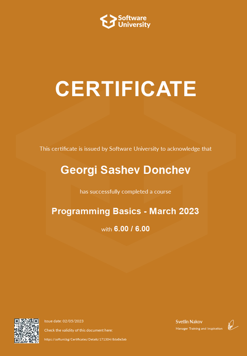
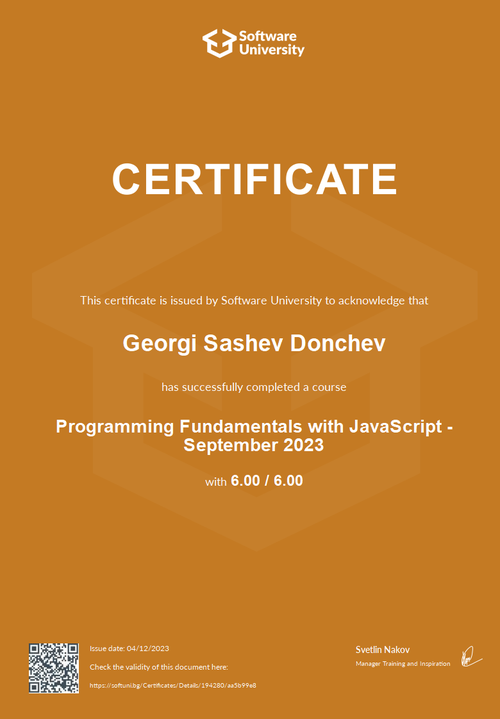
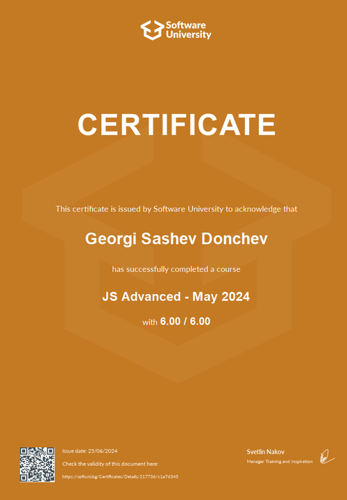
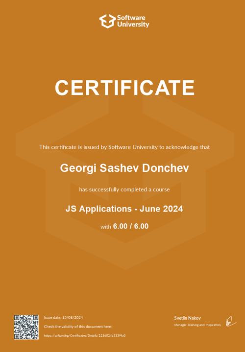
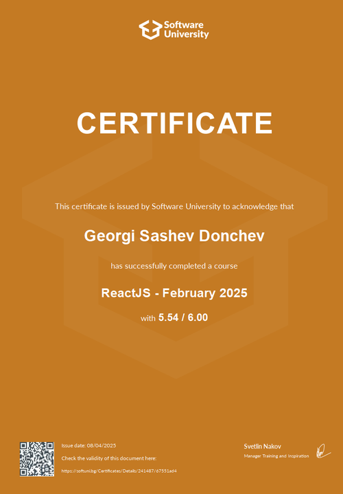
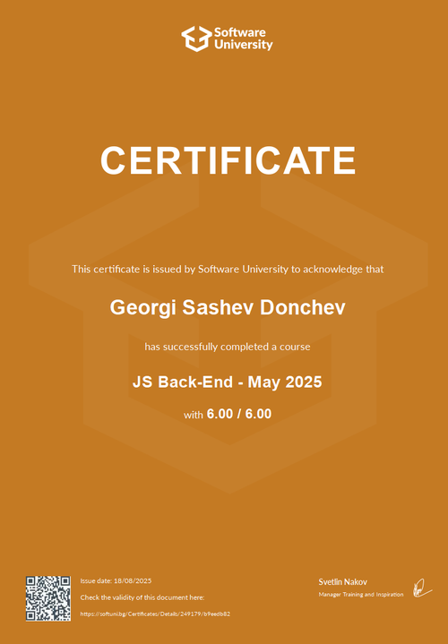
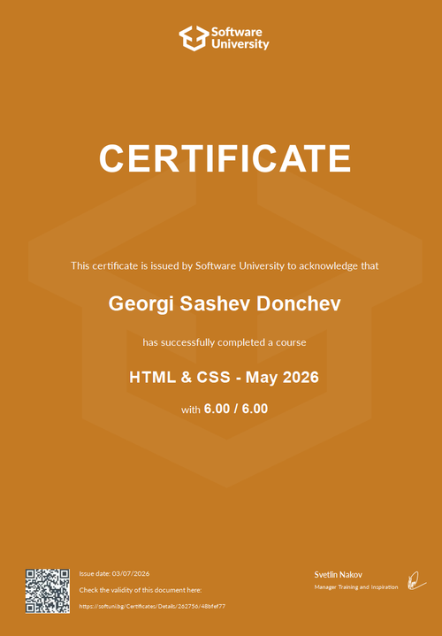
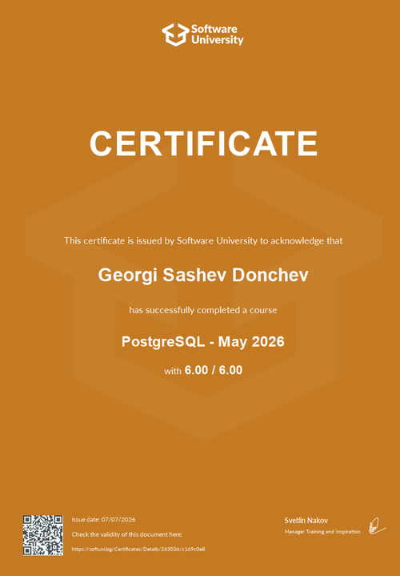

# Hi, I'm Georgi 👋

### Front-End Developer | JavaScript | React | TypeScript

I'm a developer focused on building modern web applications with
JavaScript, React and TypeScript.

🌱 Currently improving my React and TypeScript skills
💻 Building real-world web applications
🎯 Looking for opportunities to grow as a developer

## 🛠️ Tech Stack

- JavaScript
- TypeScript
- React
- HTML5
- CSS3
- Node.js
- REST APIs

## 🚀 Featured Projects

### Lost-Paws
A React-based project

### Movie Magic
A web application built with JavaScript and backend technologies.

### JS Single Page App
A single-page application demonstrating modern JavaScript development.

## 📫 Contact

- GitHub: https://github.com/jorkata187
- LinkedIn:
- Email: georgeuk26@gmail.com

## 🎓 Certificates

I have completed the following courses at **Software University (SoftUni)**:

  
  
  
  

  
  
  
  

### 📚 Learning Path

- 💻 **JavaScript** — Programming Fundamentals, JS Advanced, JS Applications
- ⚛️ **React** — ReactJS
- 🖥️ **Back-End** — JavaScript Back-End
- 🎨 **Frontend** — HTML & CSS
- 🗄️ **Database** — PostgreSQL
